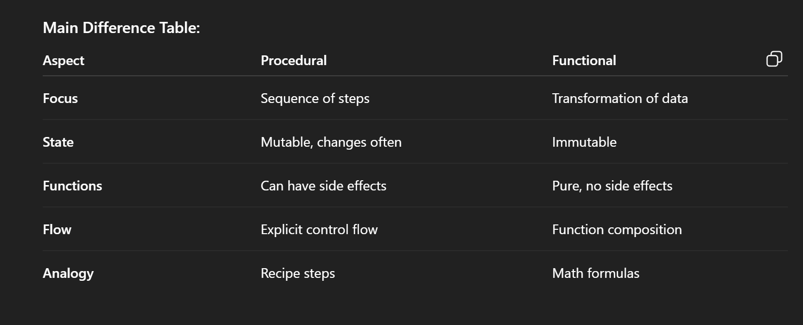
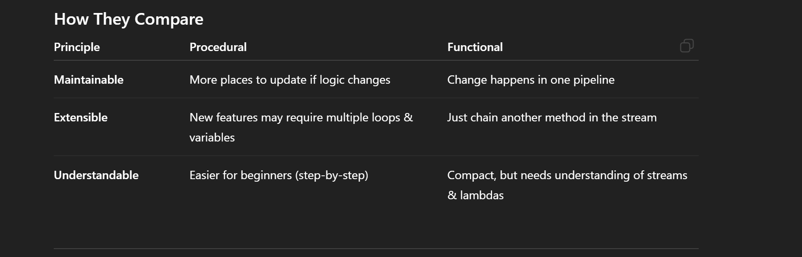
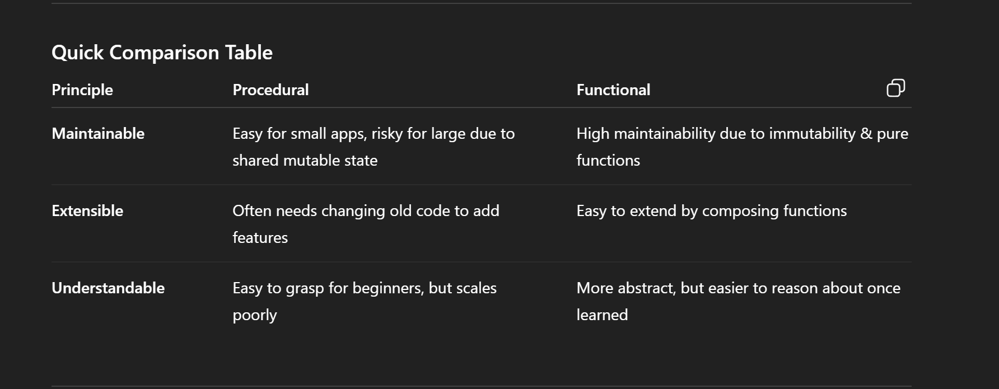
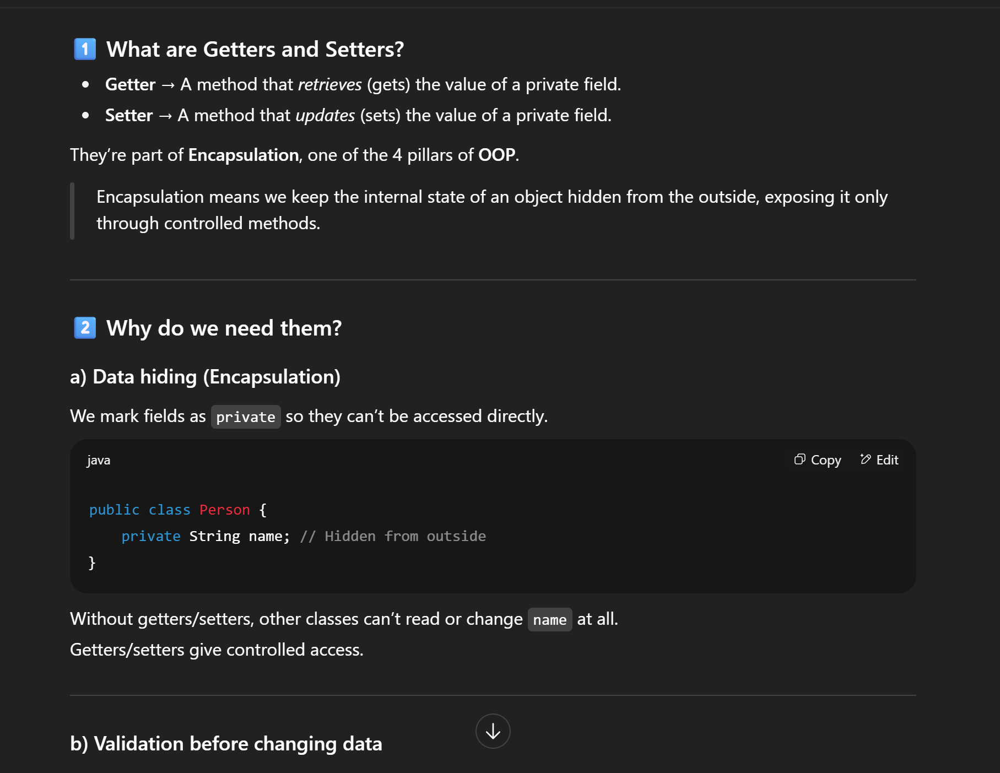
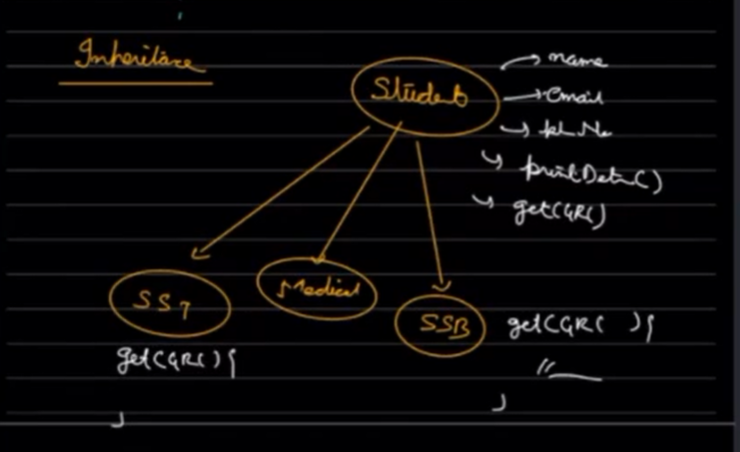
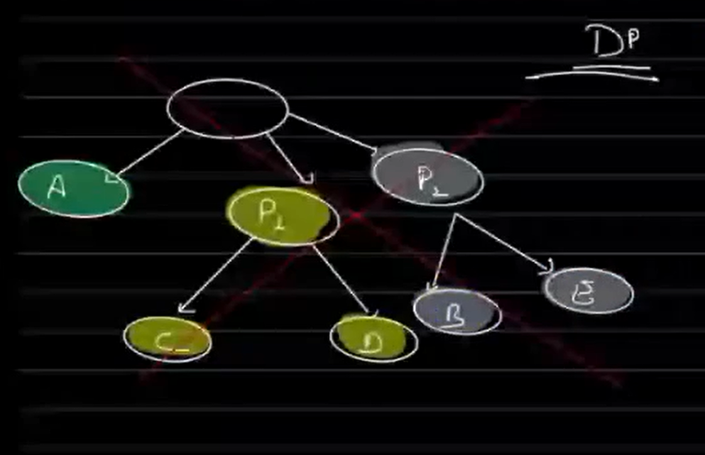
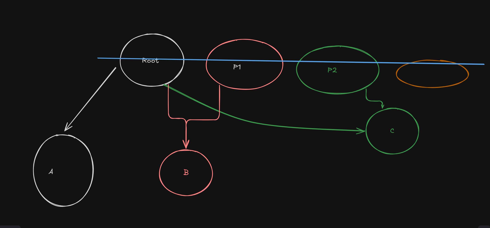

1.Procedural vs Functions

 

 -> Encapsulation

 -> Inheritance

now there is a default code for getCGR() in Student class
when extended if needed they can modify for medical and SSB students
as deafult code is for SST students they no need to change

 -> Abstraction 
as of now there is no code for getCGR() in Student class
when extended if needed they can implement for medical and SSB students
But in case medical , SSB hv not to implemented getCGR() method , it throws error

To solve this , abstract method of getCGR() is used in Student class
It ensures that the method is writted and implemented when extedned
If the method is abstract , the class hsa to be abstract

> Objects cant be created in abstract class
> child classes extending abstract class must implement the abstract methods ,  
> object can be created in child classes only

Abstraction , is the process of hiding the implementation details and showing only the essential features of the object.
Client sees only the interface and not the implementation.

# Tic Tac Toe 
1. Game class
2. Board class
3. Player class

Diff btw abstract classes and interface

overload/ride
runtime , compiletime polymorphism

