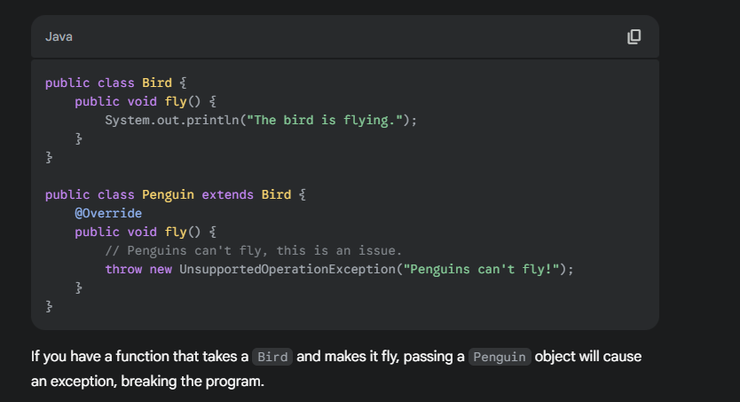

# SOLID Principles

1. Single Responsibility Principle (SRP)

2. 2Open/Closed Principle (OCP)

3. Liskov Substitution Principle (LSP)

4. Interface Segregation Principle (ISP)

5. Dependency Inversion Principle (DIP)


==========================================

1. SRP 

A class should have one reason to change.

A class should have only one job or responsibility. This means that a class should not be overloaded with multiple responsibilities, which can lead to difficulties in maintaining and testing the code.

it shld be be responsible for doing only one task

2. OCP 

Software entities should be open for extension, but closed for modification.

You should be able to add new behavior without editing existing core classes.

```java

class PriceCalculator {
public double applyDiscount(String customerType, double amount) {
switch (customerType) {
case "NEW": return amount * 0.90;
case "VIP": return amount * 0.80;
case "EMPLOYEE": return amount * 0.50;
default: return amount;
}
}
}
```

every time u hv to change new type if needed for extenbsion 

```java

interface DiscountPolicy { double apply(double amount); }


class NoDiscount implements DiscountPolicy { public double apply(double a){ return a; } }
class NewCustomerDiscount implements DiscountPolicy { public double apply(double a){ return a * 0.90; } }
class VipDiscount implements DiscountPolicy { public double apply(double a){ return a * 0.80; } }


class DiscountRegistry {
private final Map<String, DiscountPolicy> map = new HashMap<>();
public void register(String type, DiscountPolicy policy) { map.put(type, policy); }
public DiscountPolicy get(String type) { return map.getOrDefault(type, new NoDiscount()); }
}


class PriceCalculator {
private final DiscountRegistry registry;
PriceCalculator(DiscountRegistry registry){ this.registry = registry; }
public double applyDiscount(String customerType, double amount) {
return registry.get(customerType).apply(amount);
}
}
```

3. LSP

The Liskov Substitution Principle states that objects of a superclass should be replaceable with objects of its subclasses without affecting the correctness of the program. In simpler terms, if a class B is a subclass of class A, you should be able to use an object of B anywhere you would use an object of A without causing problems.



this violates LSP


4. ISP 

The Interface Segregation Principle states that no client should be forced to depend on methods it does not use. Large, "fat" interfaces should be split into smaller, more specific ones. This is similar to SRP but for interfaces.


```java
public interface IWorkable {
    void work();
}

public interface IEatable {
    void eat();
}

public interface ISleepable {
    void sleep();
}

public class Human implements IWorkable, IEatable, ISleepable {
    @Override
    public void work() { /* ... */ }
    @Override
    public void eat() { /* ... */ }
    @Override
    public void sleep() { /* ... */ }
}

public class Robot implements IWorkable {
    @Override
    public void work() {
        System.out.println("Robot is working.");
    }
}
```

5. DIP 

The Dependency Inversion Principle states that high-level modules should not depend on low-level modules. Both should depend on abstractions. Additionally, abstractions should not depend on details; details should depend on abstractions. This means you should program to an interface, not to a concrete implementation.


Consider a Switch class that directly controls a LightBulb class. The Switch is a high-level module, and the LightBulb is a low-level module. The Switch directly depends on the concrete LightBulb class.

```java
public class LightBulb {
    public void turnOn() { /* ... */ }
    public void turnOff() { /* ... */ }
}

public class Switch {
    private LightBulb bulb;

    public Switch() {
        this.bulb = new LightBulb(); // Directly creating a dependency
    }

    public void flip() {
        // ... logic
        bulb.turnOn();
    }
}
```

This is bad because Switch is tightly coupled to LightBulb. If you want the switch to control a different device, like a Fan, you would have to modify the Switch class.

Good Example 👍
Introduce an abstraction (an interface) that both the high-level and low-level modules can depend on.

```java
// Abstraction for a switchable device
public interface ISwitchableDevice {
    void turnOn();
    void turnOff();
}

// Low-level module depends on the abstraction
public class LightBulb implements ISwitchableDevice {
    @Override
    public void turnOn() { /* ... */ }
    @Override
    public void turnOff() { /* ... */ }
}

// Another low-level module
public class Fan implements ISwitchableDevice {
    @Override
    public void turnOn() { /* ... */ }
    @Override
    public void turnOff() { /* ... */ }
}

// High-level module depends on the abstraction, not the concrete class
public class Switch {
    private ISwitchableDevice device;

    public Switch(ISwitchableDevice device) { // Dependency is injected
        this.device = device;
    }

    public void flip() {
        // ...
        device.turnOn();
    }
}
```


